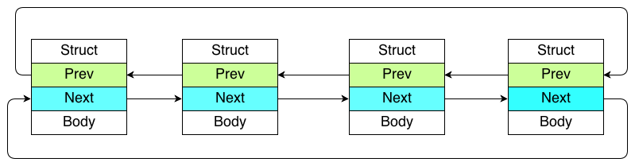

#Linux kernel Infrastructure Data Structure     

##List
###特性描述
Linux 中最常用最基本的数据结构， 利用 gcc扩展  containerof[#ContianerOf] 编译时计算出所在数据结构的偏移量，从而轻易获得整个链表节点的地址
   
     
    
>  **双向循环链表:**      

    


----------   


###API介绍
###例子
###实现剖析

##HList
###特性描述
###API介绍
###例子
```c
#include <linux/list.h>
```
###实现剖析

##KFifo
###特性描述
###API介绍
###例子
###实现剖析

##Read Copy Update 简介
##RCUList
###特性描述
###API介绍
###例子
###实现剖析

##KObject
###特性描述
###API介绍
###例子
###实现剖析


#附录
##GCC Extension 

###ContianerOf 
###TypeOf

##Sparse Checking Tools 


