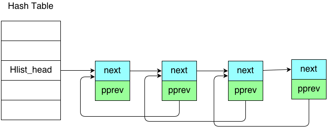

#Linux kernel Infrastructure Data Structure     

##List
###特性描述
Linux 中最常用最基本的数据结构， 双向循环链表。 不同于通常的链表实现， Linux 中的 双向循环列表 没有包含节点结构， 而是把 链表的核心结构抽象出来，然后利用 gcc扩展 [containerof](#contianerof) 编译时计算出所在数据结构的偏移量，从而轻易获得整个链表节点的地址
   
     
    
>  **双向循环链表:**      

    


----------   


###API介绍
###实现剖析
###例子


##HList
在Hash table 中使用到的链表结构， 改进自List， 更加节省空间


>  **Hash循环链表:**      

    


###特性描述
###API介绍
###例子
```c
#include <linux/list.h>
```
###实现剖析

##KFifo
###特性描述
###API介绍
###例子
###实现剖析

##Read Copy Update 简介
### RCU 核心思想
RCU  最基本的想法就是把更新的过程分解为 两部分
1. 首先创建一个影子对象，然后更新影子对象指针赋值给正式对象指针，之后等所有的读动作截止
2. 当前所有的读完成后，将被更新过的影子对象切换为正式的数据对象，旧有的对象被释放。
3. 可以选择同步等待所有读完成，也可以选择异步等待，通过回调函数来完成第二步的动作。
优点是避免了读写锁，对读操作没有干扰。 缺点就是不适合有大量写操作的场景。

### RCU 核心 API

#### rcu_read_lock()
向更新方注册读操作
#### rcu_read_unlock()
取消注册读操作
#### synchronize_rcu()
同步截止目前，所有之前的读操作
#### rcu_assign_pointer()
影子对象与正式对象之间建立映射关系
#### rcu_dereference()
### call_rcu()  
异步等待，注册回调函数_

##RCUList
###特性描述
###API介绍
###例子
###实现剖析

##KObject
主要是针对核心的内核数据结构做引用计数， 有强引用和弱引用之分
###特性描述
###API介绍
###例子
###实现剖析


#附录
##GCC Extension 

###ContianerOf 
###TypeOf

##Sparse Checking Tools 


